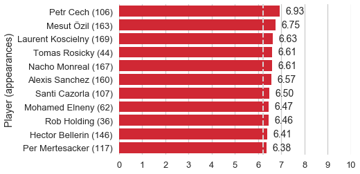
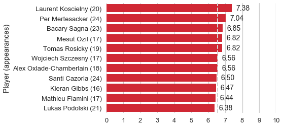
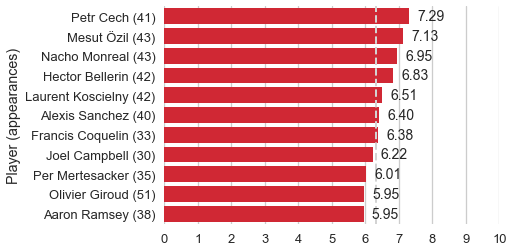

A natural first step to looking at the Arseblog ratings dataset is an exploration of some of the best performers over the time period covered. One way to do this is with a simple average of all of the ratings for each player.

*[View the code](https://github.com/deppen8/player8/blob/gh-pages/code/2018-04-02-mvps.ipynb)*

---

## All seasons

 *Top 11 players by mean fan rating for all matches in dataset (min. 30 appearances). Dotted line is team mean (6.21)*

### MVP: Petr Cech
From this simple metric, we see that Petr Cech is the top player in the dataset, at least among players with 30+ appearances registered. That shouldn't be a great surprise when you consider that he arrived at the club as a fully-established veteran who has been successful at the highest levels of the game. What is somewhat surprising, to me at least, is that Petr Cech is so *clearly* the top player. The difference between Cech's average rating (6.93) and second-placed Mesut Özil (6.75) is equivalent to the difference between Özil and sixth-ranked Alexis Sanchez (6.57). I think it is fair to say that if asked, most Arsenal fans wouldn't single out Petr Cech as Arsenal's *best* player. So let's think about what might be happening here.

My guess is that fans simply cut the goalkeeper a lot more slack than they are willing to do so for outfield players. The goalkeeper's scope to influence a match is much more narrow and clearly defined in the eyes of the fans, so perhaps if the outcome of the match, especially a negative outcome, isn't the result of some direct action of the goalkeeper, the fans are not likely to punish them significantly, relative to the outfield players.

(This question about goalkeepers is certainly a testable one but beyond the scope of this post, so I will save that for the future.)

I think the presence of Mesut Özil as the top-rated outfield player also has an interesting dimension. My sense is that most pundit accounts of Özil's time at the club would conclude that he has been good but inconsistent and hasn't totally endeared himself to the Gooners. These ratings, however, indicate that he has been the fans' favorite outfield player over the past few years and that their admiration of his performances has been more consistent than for players like Alexis Sanchez and Santi Cazorla (R.I.P.). It probably doesn't need to be said, but this underscores how essential it was for Arsenal to convince him to stay at the club.

---

## 2013-14 (after 1 January 2014)

*Top 11 players by mean fan rating for 2013-14 (min. 15 appearances). Dotted line is team mean (6.56)*

### MVP: Laurent Koscielny
Only the second half of the 2013-14 season is represented in the Arseblog fan ratings dataset, so we will include any player with at least 15 appearances. This limitation to the data results in a strange view of that season. It is hard to believe these days, but the first half of the season (prior to the available data) was characterized by a genuine title challenge! The time period where we do have data, however, represents the squad's collapses in the Premier League and Champions League. Despite those collapses, the 2013-14 season has the highest average rating of any season in the dataset (6.56) because of the team's performances in the FA Cup, claiming the club's first trophy in approximately 100,000 years. When you remove the FA Cup appearances from the data, the average fan rating for 2013-14 drops to 6.35.

The top three performers for the second half of the season were all defenders: Koscielny, Mertesacker, and Sagna. Their performances at the back were necessary for the team to steady itself in the league and make the run to the FA Cup title. Koscielny and Mertesacker of course also chipped in with important goals in the late stages of the tournament.

---

## 2014-15 Season

*Top 11 players by mean fan rating for 2014-15 (min. 30 appearances). Dotted line is team mean (6.43)*

### MVP: Alexis Sanchez
In his first season at the club, Alexis Sanchez was the only player to average a fan rating greater than 7.0. That season was another dud of a season redeemed by a late run of decent form and another FA Cup win. The team average would have been reduced to 6.30 without that FA Cup performances.

---

## 2015-16 Season

*Top 11 players by mean fan rating for 2015-16 (min. 30 appearances). Dotted line is team mean (6.31)*

### MVP: Petr Cech
Like Alexis the previous season, Cech rode a bit of first-season good will from the fans to the top rating. His 7.29 average rating is the highest of any full season in the dataset. Mesut Özil was a very strong second; his 7.13 average would have been the top rating in any of the other full seasons.

Through a certain lens, 2015-16 was a strong season for Arsenal: they finished 2nd for the first time since 2004-05. But with the other traditional powers struggling, Arsenal should have taken advantage and claimed the title. Instead, Leicester City went on an unfathomable run and Arsenal failed rise to the challenge down the stretch.

---

## 2016-17 Season

*Top 11 players by mean fan rating for 2016-17 (min. 30 appearances). Dotted line is team mean (6.20)*

### MVP: Petr Cech
There weren't any particular standouts last season, leaving Petr Cech to claim the best average rating (6.91) more on the basis of his teammates' failings than his own excellence. As I discussed above, it looks like the goalkeeper gets a little more slack than his outfield compatriots when things go south. Second-placed Laurent Koscielny's 6.67 average fan rating would not have been better than fifth in any previous season.

---

## 2017-18 Season (so far)

*Top 11 players by mean fan rating for 2017-18 (min. 15 appearances). Dotted line is team mean (5.97)*

### MVP: TBD
We will have to wait until the end of the season to make final observations, but as you might guess, this has not been a good year for just about anyone. The team average is currently below 6.00 with Alexander Lacazette riding his "new guy bump" to the top. Nacho Monreal and Jack Wilshere (a player who isn't even an automatic first-choice player) are tied in second place. It will be interesting to see how this list might shift if the team can make a run in the Europa League.