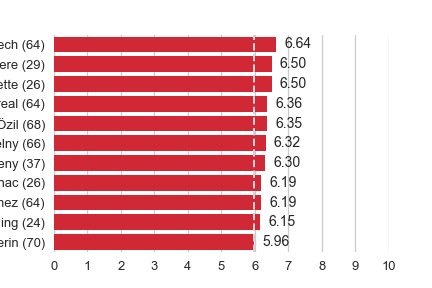
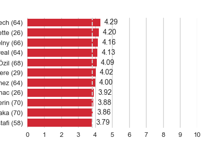

The [last post](https://deppen8.github.io/player8/2018-04-02-MVPs/) examined some of the top Arsenal performers through the past few seasons, according to the fans. The way I measured that, however, was pretty crude. I simply used straight mean values of the ratings over the given seasons. One thing (of many) that a crude measure like that ignores is the strength of the opposition. A 9.0 rating against Barcelona is much more impressive than a 9.0 against BATE Borisov (with apologies to my many Belarusian readers).[<a href="#notes">1</a>]

This post aims to bring in the strength of the opposition to the analysis. FiveThirtyEight's Soccer Power Index (SPI) is useful here as a measure of a team's strength before any given match. The SPI is used in FiveThirtyEight's [forecast of global soccer matches](https://projects.fivethirtyeight.com/soccer-predictions/), their [global club rankings](https://projects.fivethirtyeight.com/global-club-soccer-rankings/), and all of the relevant data are posted to [FiveThirtyEight's GitHub](https://github.com/fivethirtyeight/data/tree/master/soccer-spi). The broad range of leagues that are included means that we can retrieve a rating for nearly all of the opponents Arsenal has faced, both domestically and in European competitions. Some exceptions would be lower-league opposition in cup matches like the Lincoln City FA Cup match from 2017. Another benefit of the SPI ratings is that they are all scaled from 0-100, making them easy to compare across seasons and competitions. A downside to using SPI is that it the data only stretch back to the beginning of the 2016-17 season, so they can't be used for all of the Arseblog fan rating data.

*[View the code](https://github.com/deppen8/player8/blob/gh-pages/code/2018-04-11-spi-intro.ipynb)*

---

## Calculating the adjusted ratings
I am rather unoriginally calling the SPI-adjusted ratings "adjusted fan ratings". The three steps to calculate these are: 
1. Multiply a player's rating in any particular match by the SPI of the opposition at that point in time.
2. Normalize these values by dividing them by 1000, which is the theoretical maximum value: a 10.0 rating against an opponent with an SPI of 100.00.
3. Multiply this value by 10 so that it scales to the familiar 0-10 scale.[<a href="#notes">2, 3</a>]

Normalizing and scaling the values in this way allows us to easily compare the ratings on a more equal footing with one another as well as against some theoretical perfect 10.0 adjusted rating.

So, let's start by re-running the Top 11 analysis from the last post with these adjusted fan ratings.

---

## All data (2016-present)
Over the matches where we have SPI ratings, these are the top 11 players by regular old mean fan rating, unadjusted for SPI (minimum 15 appearances).

And here the same matches and players using the SPI-adjusted fan rating.

Some first glance interpretations:
- Petr Cech retains his top spot, suggesting that his top ranking is not just a function of some great performances against bad teams.
- Jack Wilshere dropped the furthest down the list suggesting that he benefits the most from performing well against weaker teams.
- As discussed in the MVPs post, big signings tend to get a "new guy bump" for their first season and Alexander Lacazette is definitely getting his. However, he is at least pulling his weight against good teams.
- It isn't a big surprise to see Koscielny, Monreal, and Özil at the top as they tend to be some of the most consistent performers. Koscielny and Monreal, especially, tend to step up in big games.
- Mohamed Elneny dropped completely out of the top 11, but I suspect this has more to do with the fact that he has not had a lot of opportunities to boost his average in the biggest matches. He hasn't put up a bunch of clunkers against poor opposition. His 2.25 minimum adjusted rating is actually the highest of player by a decent margin. This is perhaps just further evidence that when you pick Elneny, you know you will get a steady, if unspectacular, performance.

---

## Top single-game performances

<table border="1" class="dataframe">\n  <thead>\n    <tr style="text-align: center;">\n      <th></th>\n      <th>name</th>\n      <th>date</th>\n      <th>season</th>\n      <th>competition</th>\n      <th>home_away</th>\n      <th>opponent</th>\n      <th>arsegoals</th>\n      <th>oppgoals</th>\n      <th>userrating</th>\n      <th>adj_userrating</th>\n    </tr>\n  </thead>\n  <tbody>\n    <tr>\n      <th>3034</th>\n      <td>Shkodran Mustafi</td>\n      <td>2017-11-18</td>\n      <td>2017-18</td>\n      <td>Premier League</td>\n      <td>home</td>\n      <td>Sp*rs</td>\n      <td>2.0</td>\n      <td>0.0</td>\n      <td>9.5</td>\n      <td>8.0085</td>\n    </tr>\n    <tr>\n      <th>2374</th>\n      <td>David Ospina</td>\n      <td>2016-09-13</td>\n      <td>2016-17</td>\n      <td>Champions League</td>\n      <td>away</td>\n      <td>PSG</td>\n      <td>1.0</td>\n      <td>1.0</td>\n      <td>9.0</td>\n      <td>7.6185</td>\n    </tr>\n    <tr>\n      <th>181</th>\n      <td>Laurent Koscielny</td>\n      <td>2017-11-18</td>\n      <td>2017-18</td>\n      <td>Premier League</td>\n      <td>home</td>\n      <td>Sp*rs</td>\n      <td>2.0</td>\n      <td>0.0</td>\n      <td>9.0</td>\n      <td>7.5870</td>\n    </tr>\n    <tr>\n      <th>1098</th>\n      <td>Mesut Özil</td>\n      <td>2017-11-18</td>\n      <td>2017-18</td>\n      <td>Premier League</td>\n      <td>home</td>\n      <td>Sp*rs</td>\n      <td>2.0</td>\n      <td>0.0</td>\n      <td>9.0</td>\n      <td>7.5870</td>\n    </tr>\n    <tr>\n      <th>1991</th>\n      <td>Alexis Sanchez</td>\n      <td>2016-09-24</td>\n      <td>2016-17</td>\n      <td>Premier League</td>\n      <td>home</td>\n      <td>Chelsea</td>\n      <td>3.0</td>\n      <td>0.0</td>\n      <td>9.0</td>\n      <td>7.2990</td>\n    </tr>\n    <tr>\n      <th>1054</th>\n      <td>Mesut Özil</td>\n      <td>2016-09-24</td>\n      <td>2016-17</td>\n      <td>Premier League</td>\n      <td>home</td>\n      <td>Chelsea</td>\n      <td>3.0</td>\n      <td>0.0</td>\n      <td>9.0</td>\n      <td>7.2990</td>\n    </tr>\n    <tr>\n      <th>138</th>\n      <td>Laurent Koscielny</td>\n      <td>2016-09-24</td>\n      <td>2016-17</td>\n      <td>Premier League</td>\n      <td>home</td>\n      <td>Chelsea</td>\n      <td>3.0</td>\n      <td>0.0</td>\n      <td>9.0</td>\n      <td>7.2990</td>\n    </tr>\n    <tr>\n      <th>2171</th>\n      <td>Hector Bellerin</td>\n      <td>2016-09-24</td>\n      <td>2016-17</td>\n      <td>Premier League</td>\n      <td>home</td>\n      <td>Chelsea</td>\n      <td>3.0</td>\n      <td>0.0</td>\n      <td>9.0</td>\n      <td>7.2990</td>\n    </tr>\n    <tr>\n      <th>2997</th>\n      <td>Shkodran Mustafi</td>\n      <td>2016-09-24</td>\n      <td>2016-17</td>\n      <td>Premier League</td>\n      <td>home</td>\n      <td>Chelsea</td>\n      <td>3.0</td>\n      <td>0.0</td>\n      <td>9.0</td>\n      <td>7.2990</td>\n    </tr>\n    <tr>\n      <th>723</th>\n      <td>Theo Walcott</td>\n      <td>2016-09-24</td>\n      <td>2016-17</td>\n      <td>Premier League</td>\n      <td>home</td>\n      <td>Chelsea</td>\n      <td>3.0</td>\n      <td>0.0</td>\n      <td>9.0</td>\n      <td>7.2990</td>\n    </tr>\n    <tr>\n      <th>3099</th>\n      <td>Ainsley Maitland-Niles</td>\n      <td>2018-01-03</td>\n      <td>2017-18</td>\n      <td>Premier League</td>\n      <td>home</td>\n      <td>Chelsea</td>\n      <td>2.0</td>\n      <td>2.0</td>\n      <td>8.5</td>\n      <td>7.2539</td>\n    </tr>\n    <tr>\n      <th>1106</th>\n      <td>Mesut Özil</td>\n      <td>2018-01-03</td>\n      <td>2017-18</td>\n      <td>Premier League</td>\n      <td>home</td>\n      <td>Chelsea</td>\n      <td>2.0</td>\n      <td>2.0</td>\n      <td>8.5</td>\n      <td>7.2539</td>\n    </tr>\n    <tr>\n      <th>2042</th>\n      <td>Alexis Sanchez</td>\n      <td>2017-11-18</td>\n      <td>2017-18</td>\n      <td>Premier League</td>\n      <td>home</td>\n      <td>Sp*rs</td>\n      <td>2.0</td>\n      <td>0.0</td>\n      <td>8.5</td>\n      <td>7.1655</td>\n    </tr>\n    <tr>\n      <th>3122</th>\n      <td>Alexandre Lacazette</td>\n      <td>2017-11-18</td>\n      <td>2017-18</td>\n      <td>Premier League</td>\n      <td>home</td>\n      <td>Sp*rs</td>\n      <td>2.0</td>\n      <td>0.0</td>\n      <td>8.5</td>\n      <td>7.1655</td>\n    </tr>\n    <tr>\n      <th>2689</th>\n      <td>Petr Cech</td>\n      <td>2017-11-18</td>\n      <td>2017-18</td>\n      <td>Premier League</td>\n      <td>home</td>\n      <td>Sp*rs</td>\n      <td>2.0</td>\n      <td>0.0</td>\n      <td>8.5</td>\n      <td>7.1655</td>\n    </tr>\n    <tr>\n      <th>365</th>\n      <td>Nacho Monreal</td>\n      <td>2017-11-18</td>\n      <td>2017-18</td>\n      <td>Premier League</td>\n      <td>home</td>\n      <td>Sp*rs</td>\n      <td>2.0</td>\n      <td>0.0</td>\n      <td>8.5</td>\n      <td>7.1655</td>\n    </tr>\n    <tr>\n      <th>1763</th>\n      <td>Aaron Ramsey</td>\n      <td>2017-09-17</td>\n      <td>2017-18</td>\n      <td>Premier League</td>\n      <td>away</td>\n      <td>Chelsea</td>\n      <td>0.0</td>\n      <td>0.0</td>\n      <td>8.5</td>\n      <td>7.0873</td>\n    </tr>\n    <tr>\n      <th>175</th>\n      <td>Laurent Koscielny</td>\n      <td>2017-09-17</td>\n      <td>2017-18</td>\n      <td>Premier League</td>\n      <td>away</td>\n      <td>Chelsea</td>\n      <td>0.0</td>\n      <td>0.0</td>\n      <td>8.5</td>\n      <td>7.0873</td>\n    </tr>\n    <tr>\n      <th>2647</th>\n      <td>Petr Cech</td>\n      <td>2016-09-24</td>\n      <td>2016-17</td>\n      <td>Premier League</td>\n      <td>home</td>\n      <td>Chelsea</td>\n      <td>3.0</td>\n      <td>0.0</td>\n      <td>8.5</td>\n      <td>6.8935</td>\n    </tr>\n    <tr>\n      <th>318</th>\n      <td>Nacho Monreal</td>\n      <td>2016-09-24</td>\n      <td>2016-17</td>\n      <td>Premier League</td>\n      <td>home</td>\n      <td>Chelsea</td>\n      <td>3.0</td>\n      <td>0.0</td>\n      <td>8.5</td>\n      <td>6.8935</td>\n    </tr>\n  </tbody>\n</table>

Well that is interesting! When adjusted by SPI, the top individual performance was Shkodran Mustafi in the 2-0 win vs. Tottenham. Granted, there haven't been a lot of 9.5 ratings for Arsenal players since the start of the 2016-17 season, but the fact that Mustafi ranks at the top of any list is pretty amazing. He stepped up big in the derby match and the fans rewarded him accordingly.

Seeing David Ospina second in the list for his performance during a 1-1 draw in the Champions League Group Stage is also a bit of a surprise, but the specifics of the occasion make it more clear. That night at Parc des Princes, Edinson Cavani scored within the first minute of the match and PSG constantly threatened to kill Arsenal off. However, a combination of Ospina making some really instictual saves and Cavani remembering he was Edinson Cavani meant that Arsenal were able to sneak an equalizer late in the match and get a point on the road against their toughest group stage opponents.

The other entries are made up mostly of good performances against Chelsea, the only big club we seem to have any success against these days. Notably absent are any good performances against Liverpool or the Manchester clubs over the past two seasons.

The best performance in a loss was Lacazette's 6.8085 adjusted rating in the 1-3 loss at Man City in November 2017.

If Arsenal are able to progress in the Europa League, any standout performances will be likely to make this list, so stay tuned. The SPI-adjusted ratings will only become more insightful as the sample of SPI-rated matches increases.

## Notes
1. The more I think about it, the question of whether a 9.0 rating against Barcelona is more impressive than a 9.0 against BATE Borisov is not as clear cut as I make it seem. Fans might already be "pricing" these factors into their ratings. This might be worth exploring more systematically at a later date.
2. In practice, the last two steps are combined into one: divide the product of Step 1 by 100.
3. Because none of Arsenal's opponents had a perfect 100.00 SPI ranking, the adjusted ratings are always lower than the original ratings.

