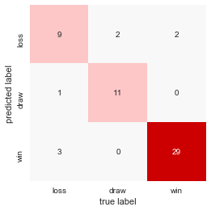
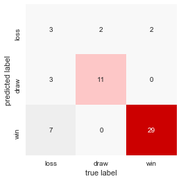

```python
import sqlite3
import pandas as pd
import seaborn as sns; sns.set()
import matplotlib.pyplot as plt
%matplotlib inline
import arserate as arse

from sklearn.metrics import confusion_matrix, classification_report
```

## Data prep


```python
db_path = '../db_files/ratings.db'  # path to data
```


```python
conn = sqlite3.connect(db_path)  # open connection to db
# construct query to get ratings data
query_data = """SELECT user_ratings.userratingID, user_ratings.playerID, games.gameID,games.wld, user_ratings.userrating 
FROM user_ratings INNER JOIN games ON user_ratings.gameID=games.gameID;"""
df_data = pd.read_sql_query(query_data, conn)  # read data from query to df
conn.close()  # close db connection
```


```python
grouped = df_data.groupby(['gameID','wld','userrating']).size().reset_index().rename(columns={0:'counts'})
grouped.head()
```


<div>
<style>
    .dataframe thead tr:only-child th {
        text-align: right;
    }

    .dataframe thead th {
        text-align: left;
    }

    .dataframe tbody tr th {
        vertical-align: top;
    }
</style>
<table border="1" class="dataframe">
  <thead>
    <tr style="text-align: right;">
      <th></th>
      <th>gameID</th>
      <th>wld</th>
      <th>userrating</th>
      <th>counts</th>
    </tr>
  </thead>
  <tbody>
    <tr>
      <th>0</th>
      <td>1</td>
      <td>win</td>
      <td>7</td>
      <td>2</td>
    </tr>
    <tr>
      <th>1</th>
      <td>1</td>
      <td>win</td>
      <td>7.5</td>
      <td>3</td>
    </tr>
    <tr>
      <th>2</th>
      <td>1</td>
      <td>win</td>
      <td>8</td>
      <td>5</td>
    </tr>
    <tr>
      <th>3</th>
      <td>1</td>
      <td>win</td>
      <td>8.5</td>
      <td>1</td>
    </tr>
    <tr>
      <th>4</th>
      <td>1</td>
      <td>win</td>
      <td>9</td>
      <td>3</td>
    </tr>
  </tbody>
</table>
</div>


```python
ml_target_group = grouped.groupby(['gameID','wld']).size().reset_index().drop(labels=[0],axis=1).set_index('gameID')
ml_target = ml_target_group['wld']
ml_target.head()
```


    gameID
    1     win
    2     win
    3     win
    4     win
    5    draw
    Name: wld, dtype: object


```python
ml_data = grouped.pivot(index='gameID', columns='userrating', values='counts').drop(labels='NA', axis=1).fillna(0.0)
print(ml_data.shape)
ml_data.head(10)
```

    (228, 19)


<div>
<style>
    .dataframe thead tr:only-child th {
        text-align: right;
    }

    .dataframe thead th {
        text-align: left;
    }

    .dataframe tbody tr th {
        vertical-align: top;
    }
</style>
<table border="1" class="dataframe">
  <thead>
    <tr style="text-align: right;">
      <th>userrating</th>
      <th>1.0</th>
      <th>1.5</th>
      <th>2.0</th>
      <th>2.5</th>
      <th>3.0</th>
      <th>3.5</th>
      <th>4.0</th>
      <th>4.5</th>
      <th>5.0</th>
      <th>5.5</th>
      <th>6.0</th>
      <th>6.5</th>
      <th>7.0</th>
      <th>7.5</th>
      <th>8.0</th>
      <th>8.5</th>
      <th>9.0</th>
      <th>9.5</th>
      <th>10.0</th>
    </tr>
    <tr>
      <th>gameID</th>
      <th></th>
      <th></th>
      <th></th>
      <th></th>
      <th></th>
      <th></th>
      <th></th>
      <th></th>
      <th></th>
      <th></th>
      <th></th>
      <th></th>
      <th></th>
      <th></th>
      <th></th>
      <th></th>
      <th></th>
      <th></th>
      <th></th>
    </tr>
  </thead>
  <tbody>
    <tr>
      <th>1</th>
      <td>0.0</td>
      <td>0.0</td>
      <td>0.0</td>
      <td>0.0</td>
      <td>0.0</td>
      <td>0.0</td>
      <td>0.0</td>
      <td>0.0</td>
      <td>0.0</td>
      <td>0.0</td>
      <td>0.0</td>
      <td>0.0</td>
      <td>2.0</td>
      <td>3.0</td>
      <td>5.0</td>
      <td>1.0</td>
      <td>3.0</td>
      <td>0.0</td>
      <td>0.0</td>
    </tr>
    <tr>
      <th>2</th>
      <td>0.0</td>
      <td>0.0</td>
      <td>0.0</td>
      <td>0.0</td>
      <td>0.0</td>
      <td>0.0</td>
      <td>0.0</td>
      <td>0.0</td>
      <td>0.0</td>
      <td>0.0</td>
      <td>1.0</td>
      <td>4.0</td>
      <td>1.0</td>
      <td>5.0</td>
      <td>2.0</td>
      <td>1.0</td>
      <td>0.0</td>
      <td>0.0</td>
      <td>0.0</td>
    </tr>
    <tr>
      <th>3</th>
      <td>0.0</td>
      <td>0.0</td>
      <td>0.0</td>
      <td>0.0</td>
      <td>0.0</td>
      <td>0.0</td>
      <td>0.0</td>
      <td>0.0</td>
      <td>0.0</td>
      <td>0.0</td>
      <td>0.0</td>
      <td>3.0</td>
      <td>1.0</td>
      <td>7.0</td>
      <td>0.0</td>
      <td>2.0</td>
      <td>0.0</td>
      <td>0.0</td>
      <td>0.0</td>
    </tr>
    <tr>
      <th>4</th>
      <td>0.0</td>
      <td>0.0</td>
      <td>0.0</td>
      <td>0.0</td>
      <td>0.0</td>
      <td>0.0</td>
      <td>0.0</td>
      <td>0.0</td>
      <td>0.0</td>
      <td>1.0</td>
      <td>0.0</td>
      <td>2.0</td>
      <td>2.0</td>
      <td>8.0</td>
      <td>0.0</td>
      <td>1.0</td>
      <td>0.0</td>
      <td>0.0</td>
      <td>0.0</td>
    </tr>
    <tr>
      <th>5</th>
      <td>0.0</td>
      <td>0.0</td>
      <td>0.0</td>
      <td>0.0</td>
      <td>0.0</td>
      <td>1.0</td>
      <td>0.0</td>
      <td>2.0</td>
      <td>1.0</td>
      <td>1.0</td>
      <td>1.0</td>
      <td>2.0</td>
      <td>3.0</td>
      <td>2.0</td>
      <td>0.0</td>
      <td>1.0</td>
      <td>0.0</td>
      <td>0.0</td>
      <td>0.0</td>
    </tr>
    <tr>
      <th>6</th>
      <td>0.0</td>
      <td>0.0</td>
      <td>0.0</td>
      <td>0.0</td>
      <td>0.0</td>
      <td>0.0</td>
      <td>0.0</td>
      <td>0.0</td>
      <td>0.0</td>
      <td>0.0</td>
      <td>0.0</td>
      <td>1.0</td>
      <td>3.0</td>
      <td>3.0</td>
      <td>3.0</td>
      <td>3.0</td>
      <td>1.0</td>
      <td>0.0</td>
      <td>0.0</td>
    </tr>
    <tr>
      <th>7</th>
      <td>2.0</td>
      <td>1.0</td>
      <td>3.0</td>
      <td>2.0</td>
      <td>1.0</td>
      <td>1.0</td>
      <td>3.0</td>
      <td>0.0</td>
      <td>1.0</td>
      <td>0.0</td>
      <td>0.0</td>
      <td>0.0</td>
      <td>0.0</td>
      <td>0.0</td>
      <td>0.0</td>
      <td>0.0</td>
      <td>0.0</td>
      <td>0.0</td>
      <td>0.0</td>
    </tr>
    <tr>
      <th>8</th>
      <td>0.0</td>
      <td>0.0</td>
      <td>0.0</td>
      <td>0.0</td>
      <td>0.0</td>
      <td>0.0</td>
      <td>0.0</td>
      <td>0.0</td>
      <td>0.0</td>
      <td>0.0</td>
      <td>0.0</td>
      <td>2.0</td>
      <td>1.0</td>
      <td>5.0</td>
      <td>4.0</td>
      <td>1.0</td>
      <td>0.0</td>
      <td>1.0</td>
      <td>0.0</td>
    </tr>
    <tr>
      <th>9</th>
      <td>0.0</td>
      <td>0.0</td>
      <td>0.0</td>
      <td>0.0</td>
      <td>0.0</td>
      <td>0.0</td>
      <td>0.0</td>
      <td>0.0</td>
      <td>2.0</td>
      <td>1.0</td>
      <td>2.0</td>
      <td>3.0</td>
      <td>6.0</td>
      <td>0.0</td>
      <td>0.0</td>
      <td>0.0</td>
      <td>0.0</td>
      <td>0.0</td>
      <td>0.0</td>
    </tr>
    <tr>
      <th>10</th>
      <td>0.0</td>
      <td>0.0</td>
      <td>0.0</td>
      <td>0.0</td>
      <td>0.0</td>
      <td>0.0</td>
      <td>0.0</td>
      <td>0.0</td>
      <td>0.0</td>
      <td>0.0</td>
      <td>0.0</td>
      <td>1.0</td>
      <td>2.0</td>
      <td>4.0</td>
      <td>3.0</td>
      <td>1.0</td>
      <td>2.0</td>
      <td>1.0</td>
      <td>0.0</td>
    </tr>
  </tbody>
</table>
</div>


## Define training and target data


```python
from sklearn.model_selection import train_test_split
Xtrain, Xtest, ytrain, ytest = train_test_split(ml_data, ml_target, random_state=42)

# ml_train_data = ml_data.iloc[:-30]
# ml_train_target = ml_target.iloc[:-30]
# ml_test_data = ml_data.iloc[-30:]
# ml_test_target = ml_target.iloc[-30:]
```

## Multinomial Naive Bayes Classification


```python
from sklearn.naive_bayes import MultinomialNB
model = MultinomialNB()
model.fit(Xtrain, ytrain)

labels = model.predict(Xtest)
```


```python
mat = confusion_matrix(ytest, labels)
sns.heatmap(mat.T, square=True, annot=True, fmt='d', cbar=False, cmap=arse.white2red(),
            xticklabels=ytrain.unique(), yticklabels=ytrain.unique())
plt.xlabel('true label')
plt.ylabel('predicted label');
```





## Random Forest Classifier


```python
from sklearn.ensemble import RandomForestClassifier

model = RandomForestClassifier(n_estimators=1000)
model.fit(Xtrain, ytrain)
ypred = model.predict(Xtest)
```


```python
print(classification_report(ypred, ytest))
```

                 precision    recall  f1-score   support
    
           draw       0.23      0.43      0.30         7
           loss       0.85      0.79      0.81        14
            win       0.94      0.81      0.87        36
    
    avg / total       0.83      0.75      0.78        57
    


```python
mat = confusion_matrix(ytest, ypred)
sns.heatmap(mat.T, square=True, annot=True, fmt='d', cbar=False, cmap=arse.white2red(),
           xticklabels=ytrain.unique(), yticklabels=ytrain.unique())
plt.xlabel('true label')
plt.ylabel('predicted label');
```




